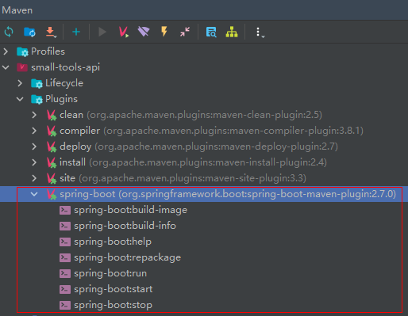

> 这里用maven打包插件举例说明

父工程`pom.xml`

```
<build>
    <!-- pluginManagement：仅仅是一种声明，当前工程或其子工程中可以对 pluginManagement 下的 plugin 进行信息的选择、继承、覆盖等 -->
    <pluginManagement>
        <plugins>
            <!-- maven打包插件：将整个工程打成一个 fatjar （注：默认集成`maven-surefire-plugin`插件） -->
            <plugin>
                <groupId>org.springframework.boot</groupId>
                <artifactId>spring-boot-maven-plugin</artifactId>
                <version>${spring-boot.version}</version>
                <configuration>
                    <finalName>${project.build.finalName}</finalName>
                    <!-- 作用:项目打成jar，同时把本地jar包也引入进去 -->
                    <includeSystemScope>true</includeSystemScope>
                </configuration>
                <executions>
                    <execution>
                        <goals>
                            <!-- 可以把依赖的包都打包到生成的Jar包中 -->
                            <goal>repackage</goal>
                        </goals>
                    </execution>
                </executions>
            </plugin>
        </plugins>
    </pluginManagement>

    <!-- plugins：子pom文件中，省去了版本、配置细节等信息，只需要指定groupId和artifactId，其他信息均从父pom文件继承。当然，如果子pom文件想定制自己的特定内容，可以另行设置，并会覆盖从父pom文件继承到的内容。 -->
    <!-- 所有子工程默认都有此插件 -->
    <plugins>
        <plugin>
            <groupId>org.springframework.boot</groupId>
            <artifactId>spring-boot-maven-plugin</artifactId>
        </plugin>
    </plugins>
</build>
```



子工程若是不想继承父工程的插件可如下配置

`pom.xml`

```
<build>
    <plugins>
        <plugin>
            <groupId>org.springframework.boot</groupId>
            <artifactId>spring-boot-maven-plugin</artifactId>
            <configuration>
                <!-- 跳过父模块的此打包插件 -->
                <skip>true</skip>
                <finalName>${project.name}</finalName>
            </configuration>
        </plugin>
    </plugins>
</build>
```