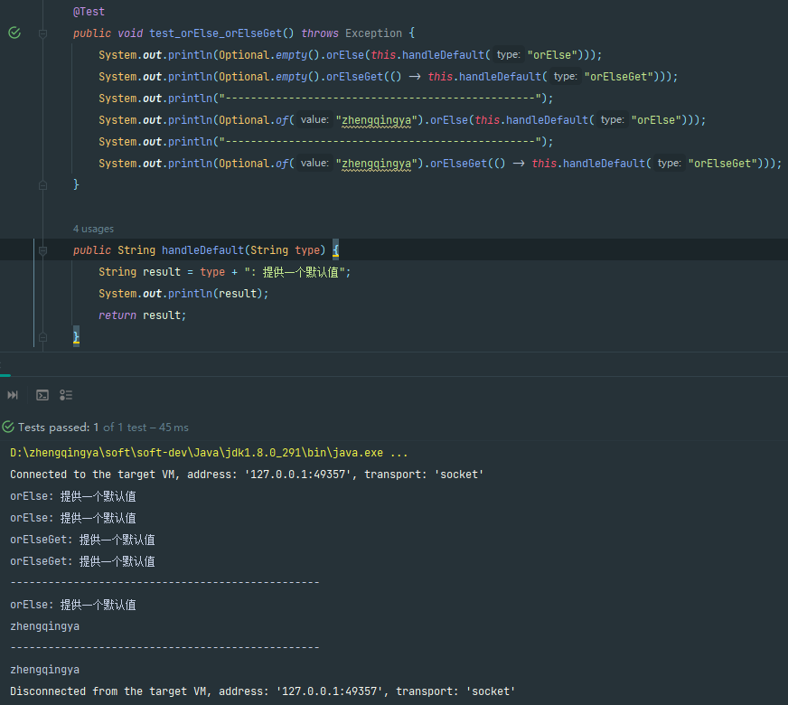
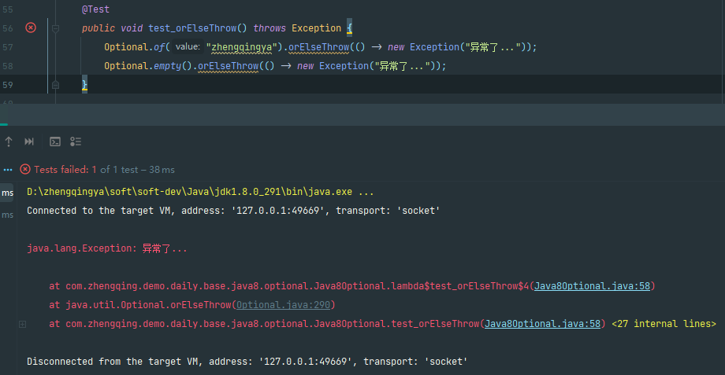

# Optional 预防空指针

Optional类: Java8解决null值判断问题，避免null导致的NPE（NullPointerException）。

### Optional 创建

```java
public class Java8Optional {
    @Test
    public void test_create() throws Exception {
        // of传入的值不能为null
        Optional<String> optional1 = Optional.of("hello");
        // 一个空的optional
        Optional<String> optional2 = Optional.empty();
        // 支持传入null值的optional
        Optional<String> optional3 = Optional.ofNullable(null);
    }
}
```

### ifPresent 判断是否为空

```java
public class Java8Optional {
    @Test
    public void test_ifPresent() throws Exception {
        Optional.ofNullable("hello").ifPresent(e -> {
            // 不为空的时候执行...
            System.out.println(e);
        });
    }
}
```

### get 获取值

```java
public class Java8Optional {
    @Test
    public void test_get() throws Exception {
        System.out.println(Optional.ofNullable("hello").get());
        System.out.println(Optional.ofNullable(null).get()); // 无值会抛异常
    }
}
```

### `orElse`/`orElseGet` 提供一个默认值

1. `orElse`: 不管是否有值都会执行
2. `orElseGet`: 有值的时候不会执行

```java
public class Java8Optional {
    @Test
    public void test_orElse_orElseGet() throws Exception {
        System.out.println(Optional.empty().orElse(this.handleDefault("orElse")));
        System.out.println(Optional.empty().orElseGet(() -> this.handleDefault("orElseGet")));
        System.out.println("-------------------------------------------------");
        System.out.println(Optional.of("zhengqingya").orElse(this.handleDefault("orElse")));
        System.out.println("-------------------------------------------------");
        System.out.println(Optional.of("zhengqingya").orElseGet(() -> this.handleDefault("orElseGet")));
    }

    public String handleDefault(String type) {
        String result = type + ": 提供一个默认值";
        System.out.println(result);
        return result;
    }
}
```



### orElseThrow 为空的时候抛出异常

```java
public class Java8Optional {
    @Test
    public void test_orElseThrow() throws Exception {
        Optional.of("zhengqingya").orElseThrow(() -> new Exception("异常了..."));
        Optional.empty().orElseThrow(() -> new Exception("异常了..."));
    }
}
```



---

### 小demo

```java
public class Java8Optional {
    @Test
    public void test_Optional() throws Exception {
        List<Integer> list = null;
        List<Integer> list2 = Optional.ofNullable(list).orElse(Lists.newArrayList());

        User user = User.builder().id(666).build();

        // 方式1：if判断
        int id = 1;
        if (user != null) {
            if (user.getId() != null) {
                id = user.getId();
            }
        }
        System.out.println(id);

        // 方式2：三目运算符
        int id2 = user != null ? (user.getId() != null ? user.getId() : 1) : 1;
        System.out.println(id2);

        // 方式3：Java8-Optional
        int id3 = Optional
                // 里面为空值判断 三目运算符
                .ofNullable(user)
                // 取id值
                .map(User::getId)
                // 如果上面id为空，提供一个默认值
                .orElse(1);
        System.out.println(id3);

        System.out.println("-------------------------");
        user = null;
        Optional.ofNullable(user).ifPresent(e -> {
            // 不为空的时候执行...
            System.out.println(e);
        });

        // 为空的时候抛出异常
        Optional.ofNullable(user).orElseThrow(() -> new Exception("异常了..."));
    }

    @Data
    @SuperBuilder
    @NoArgsConstructor
    @AllArgsConstructor
    static class User {
        private Integer id;
        private String username;
    }
}
```
