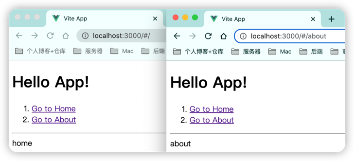

`my-vue-router/src/router/index.js`

```js
import { createRouter, createWebHashHistory } from "vue-router";

// 1. 定义路由组件.
import Home from "../views/Home.vue";
import About from "../views/About.vue";

// 2. 定义一些路由
// 每个路由都需要映射到一个组件。
const routes = [
  { path: "/", component: Home },
  { path: "/about", component: About },
];

// 3. 创建路由实例并传递 `routes` 配置
const router = createRouter({
  // 4. 内部提供了 history 模式的实现。为了简单起见，我们在这里使用 hash 模式。
  history: createWebHashHistory(),
  routes, // `routes: routes` 的缩写
});

export default router;
```

`my-vue-router/src/main.js`

```js
import { createApp } from "vue";
import App from "./App.vue";
import router from "./router";

const app = createApp(App);
// 使用路由
app.use(router);
app.mount("#app");
```

`my-vue-router/src/views/Home.vue`

```vue
<template>
  <div>home</div>
</template>
```

`my-vue-router/src/views/About.vue`

```vue
<template>
  <div>about</div>
</template>
```

`my-vue-router/src/App.vue`

```vue
<template>
  <div>
    <h1>Hello App!</h1>
    <!--使用 router-link 组件进行导航 -->
    <!--通过传递 `to` 来指定链接 -->
    <!--`<router-link>` 将呈现一个带有正确 `href` 属性的 `<a>` 标签-->
    <ol>
      <li><router-link to="/">Go to Home</router-link></li>
      <li><router-link to="/about">Go to About</router-link></li>
    </ol>
    <hr />
    <!-- 路由出口 -->
    <!-- 路由匹配到的组件将渲染在这里 -->
    <router-view></router-view>
  </div>
</template>
```