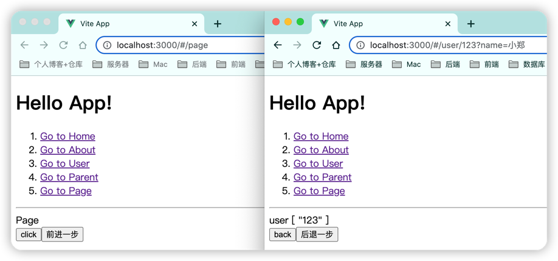

通过js跳转页面



`my-vue-router/src/App.vue`

```vue
<router-link to="/page">Go to Page</router-link>
```

`my-vue-router/src/views/Page.vue`

```vue
<template>
  <div>Page</div>
  <button @click="goPage">click</button>
  <button @click="$router.forward()">前进一步</button>
</template>
<script>
export default {
  methods: {
    goPage() {
      console.log(this.$router);
      // this.$router.push("/parent");
      this.$router.push({
        path: "/user/123",
        query: { name: "小郑" },
      });
    },
  },
};
</script>
```

`my-vue-router/src/views/User.vue`

```vue
<template>
  <div>user {{ $route.params.id }}</div>
  <button @click="$router.go(-1)">back</button>
  <button @click="$router.back()">后退一步</button>
</template>
<script setup>
import { useRoute } from "vue-router";
console.log(useRoute().params.id);
console.log(useRoute().query.name);
</script>
```