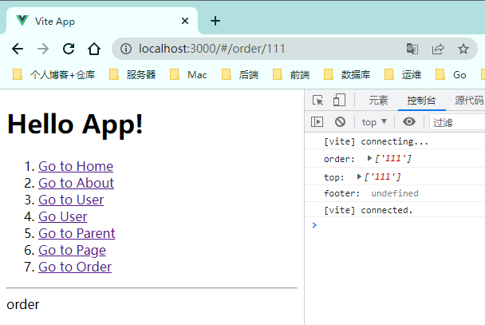

`my-vue-router/src/router/index.js`

`props: true`

```js
const routes = [
    { path: "/user/:id*", name: "user", props: true, component: User },
    // 命名视图
    {
        path: "/order/:id*",
        components: {
            default: Order,
            // Top: Top 的缩写
            Top,
            // 它们与 `<router-view>` 上的 `name` 属性匹配
            Footer: Footer,
        },
        props: {
            // true:标识能拿到参数，false:不能
            default: true,
            Top: true,
            Footer: false,
        },
    },
];
```

`my-vue-router/src/views/User.vue`

```vue
<template>
  <div>user {{ $route.params.name }}</div>
  <button @click="$router.go(-1)">back</button>
  <button @click="$router.back()">后退一步</button>
</template>
<!-- 组合式API -->
<script setup>
const props = defineProps({
  id: String,
});
console.log(props);
console.log(props.id);
</script>
```
`my-vue-router/src/views/Top.vue`

```vue
<template>
  <h2>头部</h2>
</template>
<script>
// 选项式API
export default {
  props: ["id"],
  mounted() {
    console.log("top: ", this.id);
  },
};
</script>
```

`my-vue-router/src/views/Footer.vue`

```vue
<template>
  <h2>尾部</h2>
</template>
<script>
// 选项式API
export default {
  props: ["id"],
  mounted() {
    console.log("footer: ", this.id);
  },
};
</script>
```