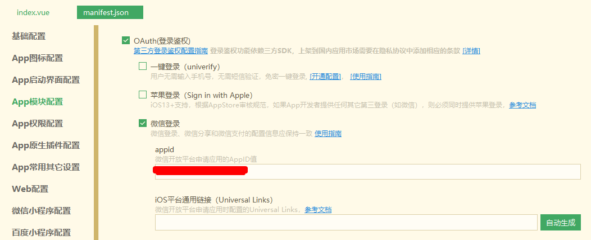

# 微信小程序登录

> 可参考： https://uniapp.dcloud.net.cn/api/plugins/login.html#getuserprofile

### 一、打开 `manifest.json` -> App模块权限配置，勾选 OAuth(登录鉴权)



### 二、uniapp

```
<template>
	<view>
		<!-- 获取基本信息 -->
		<button type="primary" withCredentials="true" @tap="getUserProfile">授权登录</button>
		<!-- 获取手机号 https://developers.weixin.qq.com/miniprogram/dev/framework/open-ability/getPhoneNumber.html -->
		<!-- <button open-type="getPhoneNumber" @getphonenumber="getPhoneNumber">获取手机号</button> -->
	</view>
</template>

<script>
	export default {
		data() {
			return {};
		},
		onLoad() {},
		methods: {
			getUserProfile() {
				uni.getUserProfile({
					desc: '登录',
					success: async (data) => {
						// 拿到的微信用户信息
						console.log(data)
						uni.login({
							provider: 'weixin',
							success: async (res) => {
								console.log(res)
								// 请求后台获取openid注册登录成功后返回基本用户信息
								let userInfo = await this.$api.user.login({
									code: res.code,
									iv: data.iv,
									encryptedData: data.encryptedData,
									userInfo: {
										nickName: data.userInfo.nickName,
										avatarUrl: data.userInfo.avatarUrl
									}
								})
								console.log(userInfo)
							}
						})
					},
					fail: (err) => {
						console.log(err);
					}
				})
			}
		}
	};
</script>

<style lang="scss" scoped></style>
```

### 三、java

#### 1、pom.xml

```
<!-- 微信小程序 -->
<!-- https://mvnrepository.com/artifact/com.github.binarywang/weixin-java-pay -->
<dependency>
    <groupId>com.github.binarywang</groupId>
    <artifactId>weixin-java-miniapp</artifactId>
    <version>4.3.6.B</version>
</dependency>
<!-- 解决报错： nested exception is java.lang.NoClassDefFoundError: org/apache/commons/lang3/RegExUtils -->
<!-- https://mvnrepository.com/artifact/org.apache.commons/commons-lang3 -->
<dependency>
    <groupId>org.apache.commons</groupId>
    <artifactId>commons-lang3</artifactId>
    <version>3.12.0</version>
</dependency>
```

#### 2、bootstrap.yml

```
# 微信小程序
wx:
  miniapp:
    appid: xxx
    secret: xxx
    msgDataFormat: JSON
```

#### 3、config

```
@Data
@ConfigurationProperties(prefix = "wx.miniapp")
public class WxMaProperty {
    /**
     * 设置微信小程序的appid
     */
    private String appid;

    /**
     * 设置微信小程序的Secret
     */
    private String secret;

    /**
     * 消息格式，XML或者JSON
     */
    private String msgDataFormat;
}
```

```
@Configuration
@EnableConfigurationProperties(WxMaProperty.class)
public class WxMaConfig {
    @Bean
    public WxMaService wxMaService(WxMaProperty properties) {
        WxMaDefaultConfigImpl config = new WxMaDefaultConfigImpl();
        config.setAppid(properties.getAppid());
        config.setSecret(properties.getSecret());
        config.setMsgDataFormat(properties.getMsgDataFormat());

        WxMaService service = new WxMaServiceImpl();
        service.setWxMaConfig(config);
        return service;
    }
}
```

#### 4、demo

```
@Override
@Transactional(rollbackFor = Exception.class)
@SneakyThrows(Exception.class)
public UmsUserVO wxLogin(UmsUserWxLoginDTO params) {
    /**
     * 可参考 https://open.weixin.qq.com/cgi-bin/showdocument?action=dir_list&t=resource/res_list&verify=1&id=open1419317853&token=&lang=zh_CN
     */
    String code = params.getCode();
    WxMaJscode2SessionResult wxMaJscode2SessionResult = this.wxMaService.jsCode2SessionInfo(code);
    String openid = wxMaJscode2SessionResult.getOpenid();
    String sessionKey = wxMaJscode2SessionResult.getSessionKey();
    String encryptedData = params.getEncryptedData();
    String iv = params.getIv();
    // 用户信息校验
//        Assert.isTrue(this.wxMaService.getUserService().checkUserInfo(sessionKey, params.getRawData(), params.getSignature()), "用户信息错误！");
    // 获取小程序用户信息
//        WxMaUserInfo wxMaUserInfo = this.wxMaService.getUserService().getUserInfo(sessionKey, encryptedData, iv);

    return null;
}
```

```
@Data
@SuperBuilder
@NoArgsConstructor
@AllArgsConstructor
@EqualsAndHashCode(callSuper = true)
@ApiModel
public class UmsUserWxLoginDTO extends BaseDTO {

    @NotNull
    @ApiModelProperty("消息密文")
    private String encryptedData;

    @NotNull
    @ApiModelProperty("加密算法的初始向量")
    private String iv;

    @NotNull
    @ApiModelProperty("动态令牌")
    private String code;

    @ApiModelProperty("用户信息")
    private WxUserInfo userInfo;

    @Data
    @Builder
    @NoArgsConstructor
    @AllArgsConstructor
    public static class WxUserInfo {
        @ApiModelProperty("昵称")
        private String nickName;

        @ApiModelProperty("头像")
        private String avatarUrl;
    }

}
```