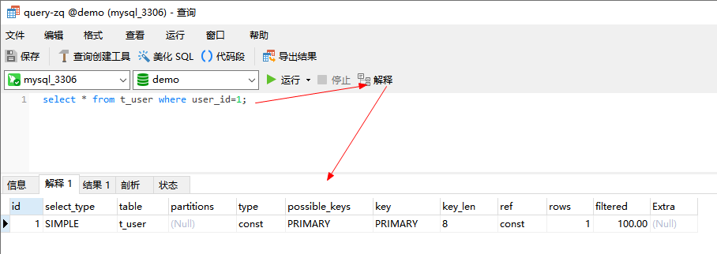

# EXPLAIN 解析

> 用于进行慢查询sql分析与优化。

### Explain语法：

```
explain select … from … [where …]
```

ex:

```
explain select * from t_user where user_id=1;
```

```
+----+-------------+--------+------------+-------+---------------+---------+---------+-------+------+----------+-------+
| id | select_type | table  | partitions | type  | possible_keys | key     | key_len | ref   | rows | filtered | Extra |
+----+-------------+--------+------------+-------+---------------+---------+---------+-------+------+----------+-------+
|  1 | SIMPLE      | t_user | NULL       | const | PRIMARY       | PRIMARY | 8       | const |    1 |   100.00 | NULL  |
+----+-------------+--------+------------+-------+---------------+---------+---------+-------+------+----------+-------+
1 row in set, 1 warning (0.00 sec)
```

Navicat中可点击解释查看




### 各字段解释

```
1、id：SELECT查询标志位，每个SELECT都会自动分配一个唯一标识符。数字越大越先执行，如果说数字一样大，那么就从上往下依次执行，id列为null的就表示这是一个结果集，不需要使用它来进行查询。
2、select_type：select_type就是select的类型，可以有以下几种：
    SIMPLE：简单SELECT(不使用UNION或子查询等)
    PRIMARY：最外面的SELECT
    UNION：UNION中的第二个或后面的SELECT语句
    DEPENDENT UNION：UNION中的第二个或后面的SELECT语句，取决于外面的查询
    UNION RESULT：UNION的结果。
    SUBQUERY：子查询中的第一个SELECT
    DEPENDENT SUBQUERY：子查询中的第一个SELECT，取决于外面的查询
    DERIVED：导出表的SELECT(FROM子句的子查询)
3、table：显示这一行的数据是关于哪张表的
4、type：这列最重要，显示了连接使用了哪种类别,有无使用索引，是使用Explain命令分析性能瓶颈的关键项之一
    结果值从好到坏依次是：
        system > const > eq_ref > ref > fulltext > ref_or_null > index_merge > unique_subquery > index_subquery > range > index > ALL
        一般来说，得保证查询至少达到range级别，最好能达到ref，否则就可能会出现性能问题。
    system: const 的一种特例，表中只有一行数据
    const: 针对主键或唯一性索引的等值查询扫描，最多只返回一行数据
    eq_ref: 通常出现在多表的join查询，表示针对于前表的每一个结果，都只能匹配到后表的一行结果
    ref: 通常出现在多表的join查询，针对非主键索引 或 非唯一索引 或 使用了最左前缀匹配的索引查询（ ex:通过普通索引查询匹配很多行时）
    fulltext: 全文索引
    ref_or_null: 跟 ref 类似的效果，不过多一个列不能 null 的条件
    index_merge: 此连接类型表示使用了索引合并优化。在这种情况下，输出行中的 key 列包含使用的索引列表，key_len包含所用索引的最长 key 部分列表
    unique_subquery: 在使用 in 查询的情况下会取代 eq_ref
    range: 使用索引范围查询，一个有限制的索引扫描。key 列显示使用了哪个索引。当使用=、 <>、>、>=、<、<=、IS NULL、<=>、BETWEEN 或者 IN 操作符，用常量比较关键字列时,可以使用 range
           当 type 是 range 时, 那么 EXPLAIN 输出的 ref 字段为 NULL, 并且 key_len 字段是此次查询中使用到的索引的最长的那个
    index: 全索引扫描（full index scan），扫描所有的索引, 而不扫描数据。
           只是扫描表的时候按照索引次序进行而不是行。主要优点就是避免了排序, 但是开销仍然非常大。如在Extra列看到Using index，说明正在使用覆盖索引，只扫描索引的数据，它比按索引次序全表扫描的开销要小很多
    ALL: 全表扫描
5、possible_keys：在查询时，能够使用到的索引
6、key：在当前查询时真正使用到的索引。如果没有选择索引，键是NULL
7、key_len：显示MySQL决定使用的键长度。如果键是NULL，则长度为NULL。使用的索引的长度。在不损失精确性的情况下，长度越短越好
           key_len 的计算规则如下:
           字符串
               char(n): n 字节长度
               varchar(n): 如果是 utf8 编码, 则是 3 n + 2字节; 如果是 utf8mb4 编码, 则是 4 n + 2 字节。
           数值类型:
               TINYINT: 1字节
               SMALLINT: 2字节
               MEDIUMINT: 3字节
               INT: 4字节
               BIGINT: 8字节
           时间类型
               DATE: 3字节
               TIMESTAMP: 4字节
               DATETIME: 8字节
           字段属性: NULL 属性 占用一个字节. 如果一个字段是 NOT NULL 的, 则没有此属性。
8、ref：显示使用哪个列或常数与key一起从表中选择行。
9、rows：MySQL 查询优化器根据统计信息, 估算 SQL 要查找到结果集需要扫描读取的数据行数。
10、Extra：包含MySQL解决查询的详细信息，也是关键参考项之一。
        Using filesort：MySQL需额外的排序操作,不能通过索引顺序达到排序效果.一般有 Using filesort,都建议优化去掉,因为这样的查询CPU资源消耗大。
        Using temporary：查询有使用临时表,一般出现于排序,分组和多表join的情况(不是GROUP BY上), 查询效率不高, 建议优化。
        Using index：使用覆盖索引
        Using where：在查找使用索引的情况下，需要回表去查询所需的数据
        Using index condition：查找使用了索引，但是需要回表查询数据
        Using where; Using index => 查找使用了索引，但是需要的数据都在索引列中能找到，所以不需要回表查询数据
        Distinct：一旦MYSQL找到了与行相联合匹配的行，就不再搜索了
        Not exists：MYSQL 优化了LEFT JOIN，一旦它找到了匹配LEFT JOIN标准的行，就不再搜索了
        Range checked for each
        Record（index map:#） 没有找到理想的索引，因此对于从前面表中来的每一个行组合，MYSQL检查使用哪个索引，并用它来从表中返回行。这是使用索引的最慢的连接之一
```

### 其它

当type 显示为 “index” 时，并且Extra显示为“Using Index”， 表明使用了覆盖索引。
