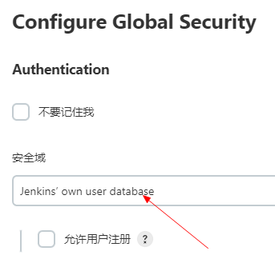

# 重置账号密码

### 1、去掉jenkins认证

```shell
cd /root/.jenkins
```

注释`config.xml`文件中下面配置&保存

```
<useSecurity>true</useSecurity>
<authorizationStrategy class="hudson.security.FullControlOnceLoggedInAuthorizationStrategy">
    <denyAnonymousReadAccess>true</denyAnonymousReadAccess>
</authorizationStrategy>
<securityRealm class="hudson.security.HudsonPrivateSecurityRealm">
    <disableSignup>true</disableSignup>
    <enableCaptcha>false</enableCaptcha>
</securityRealm>
```

### 2、重启jenkins

这里可以直接访问jenkins，即无需账号也可进入jenkins了...

### 3、开启jenkins用户数据库

`Manage Jenkins` -> `Configure Global Security`

配置&保存



### 4、修改账号密码

`Manage Jenkins` -> `Manage Users`


### 5、还原认证 & 重启jenkins进行登录认证

将`config.xml`中之前注释的认证配置还原

由于步骤3的操作，可能会是如下配置，这个和之前的配置有所差异，需要删除，使用原来注释掉的配置信息!

```
  <useSecurity>true</useSecurity>
  <authorizationStrategy class="hudson.security.AuthorizationStrategy$Unsecured"/>
  <securityRealm class="hudson.security.HudsonPrivateSecurityRealm">
    <disableSignup>true</disableSignup>
    <enableCaptcha>false</enableCaptcha>
  </securityRealm>
```
