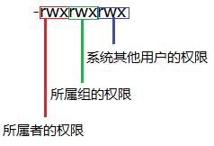

# chmod修改文件权限

```shell
-rw-r--r-- 1 root root     4 1月   3 17:37 b.txt
-rw-r--r-- 1 root root 87765 1月   3 17:25 README.md
-rwxrwxrwx 1 root root 74552 1月   3 17:20 zhengqingya.sh
```



| 参数  | 含义                          |
|-----|-----------------------------|
| -r  | 赋予读取权限                      |
| -w  | 赋予写入权限                      |
| -x  | 赋予执行权限                      |
| 777 | 赋予可读、可写、可执行权限（读：4，写：2，执行：1） |

### 符号模式

```shell
chmod [ugo][+-=][rwx] file
```

`[ugo]`定义权限作用的对象:

- `u` -> 所属者
- `g` -> 所属组
- `o` -> 系统其他用户

`[+-=]`:

- `+` -> 在现有权限基础上增加权限
- `-` -> 在现有权限基础上移除权限
- `=` -> 将权限设置成后面的值

`[rwx]`: 权限rwx

示例：

```shell
# 给目标文件的所属者增加w权限
chmod u+w zhengqingya.sh
# 给目标文件的所属者增加w权限，所属组增加x权限，系统其他用户增加w权限
chmod u+wx,g+x,o+w zhengqingya.sh
# 给目标文件的其他用户移除w权限
chmod o-w zhengqingya.sh
# 不管所属者拥有什么权限，该符号模式给所属者赋予rwx权限
chmod u=rwx zhengqingya.sh
```

### 八进制模式

读：4，写：2，执行：1

- -rw------- (600)    只有拥有者有读写权限。
- -rw-r--r-- (644)    只有拥有者有读写权限；而属组用户和其他用户只有读权限。
- -rwx------ (700)    只有拥有者有读、写、执行权限。
- -rwxr-xr-x (755)    拥有者有读、写、执行权限；而属组用户和其他用户只有读、执行权限。
- -rwx--x--x (711)    拥有者有读、写、执行权限；而属组用户和其他用户只有执行权限。
- -rw-rw-rw- (666)    所有用户都有文件读、写权限。
- -rwxrwxrwx (777)    所有用户都有读、写、执行权限。

> `-R`选项可以让权限改变递归地作用到文件和子目录

```shell
# 当前目录下所有文件赋予权限(读、写、执行) 给 所有用户
chmod -R 777 ./xx

# 给目标文件的所属者增加rwx权限，所属组增加rw权限，系统其他用户增加r权限
chmod 764 zhengqingya.sh
# -rwxrw-r-- 1 root root 74552 1月   3 17:33 zhengqingya.sh
```
