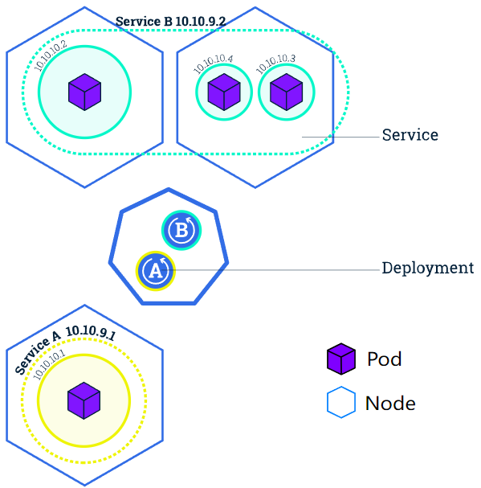
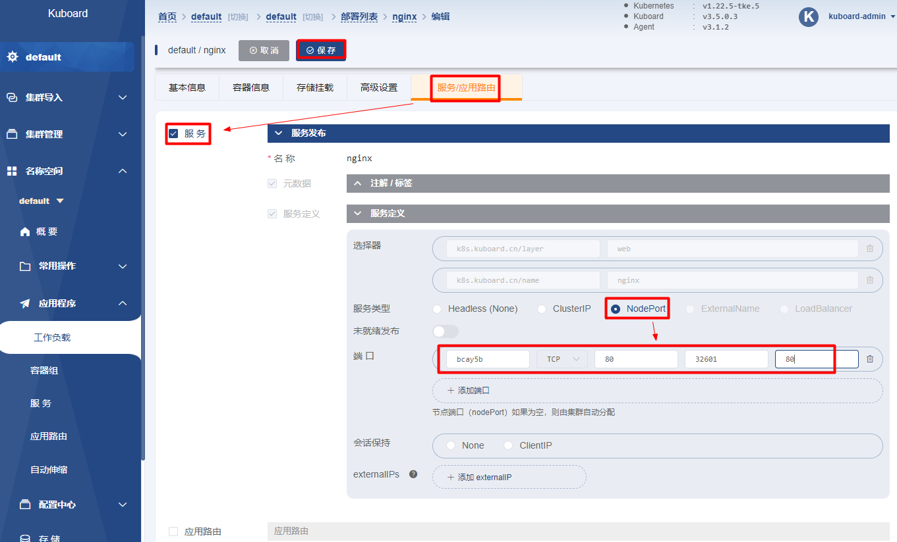

# 公布应用程序

### 1、Kubernetes Service（服务）概述

事实上，Pod（容器组）有自己的 生命周期 (opens new window)。当 worker node（节点）故障时，节点上运行的 Pod（容器组）也会消失。
然后，Deployment可以通过创建新的Pod（容器组）来动态地将群集调整回原来的状态，以使应用程序保持运行。

举个例子，假设有一个图像处理后端程序，具有 3 个运行时副本。
这 3 个副本是可以替换的（无状态应用），即使 Pod（容器组）消失并被重新创建，或者副本数由 3 增加到 5，前端系统也无需关注后端副本的变化。
由于 Kubernetes 集群中每个 Pod（容器组）都有一个唯一的 IP 地址（即使是同一个 Node 上的不同 Pod），我们需要一种机制，为前端系统屏蔽后端系统的 Pod（容器组）在销毁、创建过程中所带来的 IP 地址的变化。

Kubernetes 中的 Service（服务） 提供了这样的一个抽象层，它选择具备某些特征的 Pod（容器组）并为它们定义一个访问方式。
Service（服务）使 Pod（容器组）之间的相互依赖解耦（原本从一个 Pod 中访问另外一个 Pod，需要知道对方的 IP 地址）。
一个 Service（服务）选定哪些 Pod（容器组） 通常由 LabelSelector(标签选择器) 来决定。

在创建Service的时候，通过设置配置文件中的 `spec.type` 字段的值，可以以不同方式向外部暴露应用程序：

- `ClusterIP`（默认）: 在群集中的内部IP上公布服务，这种方式的 Service（服务）只在集群内部可以访问到
- `NodePort`: 使用 NAT 在集群中每个的同一端口上公布服务。这种方式下，可以通过访问集群中任意节点+端口号的方式访问服务 `<NodeIP>:<NodePort>`。此时 ClusterIP 的访问方式仍然可用。
- `LoadBalancer`: 在云环境中（需要云供应商可以支持）创建一个集群外部的负载均衡器，并为使用该负载均衡器的 IP 地址作为服务的访问地址。此时 ClusterIP 和 NodePort 的访问方式仍然可用。

> tips: Service是一个抽象层，它通过 LabelSelector 选择了一组 Pod（容器组），把这些 Pod 的指定端口公布到到集群外部，并支持负载均衡和服务发现。
> - 公布 Pod 的端口以使其可访问
> - 在多个 Pod 间实现负载均衡
> - 使用 Label 和 LabelSelector

### 2、服务和标签

下图中有两个服务Service A(黄色虚线)和Service B(蓝色虚线) Service A 将请求转发到 IP 为 `10.10.10.1` 的Pod上， Service B 将请求转发到 IP 为
`10.10.10.2`、`10.10.10.3`、`10.10.10.4` 的Pod上。

Service 将外部请求路由到一组 Pod 中，它提供了一个抽象层，使得 Kubernetes 可以在不影响服务调用者的情况下，动态调度容器组（在容器组失效后重新创建容器组，增加或者减少同一个 Deployment 对应容器组的数量等）。

Service使用 Labels、LabelSelector(标签和选择器) 匹配一组 Pod。Labels（标签）是附加到 Kubernetes 对象的键/值对，其用途有多种：

- 将 Kubernetes 对象（Node、Deployment、Pod、Service等）指派用于开发环境、测试环境或生产环境
- 嵌入版本标签，使用标签区别不同应用软件版本
- 使用标签对 Kubernetes 对象进行分类

下图体现了 Labels（标签）和 LabelSelector（标签选择器）之间的关联关系

- Deployment B 含有 LabelSelector 为 app=B `通过此方式声明含有 app=B 标签的 Pod 与之关联`
- 通过 Deployment B 创建的 Pod 包含标签为 app=B
- Service B 通过标签选择器 app=B 选择可以路由的 Pod

Labels（标签）可以在创建 Kubernetes 对象时附加上去，也可以在创建之后再附加上去。任何时候都可以修改一个 Kubernetes 对象的 Labels（标签）

### 3、实战：为您的 nginx Deployment 创建一个 Service

在上一个步骤中创建的工作负载查看界面点击 `编辑` 按钮

在工作负载编辑页切换到 `服务/应用路由` 标签，填写并保存

访问服务： `http://<任意节点的IP>:32601`

