# DevOps

> demo源码见：https://gitee.com/zhengqingya/java-workspace
> 基于`kubesphere 3.2.1`

自动检出 (Checkout) 代码、测试、分析、构建、部署并发布


> - 企业空间：`my-workspace`
> - 项目：`my-project`

### 一、创建`DevOps项目`


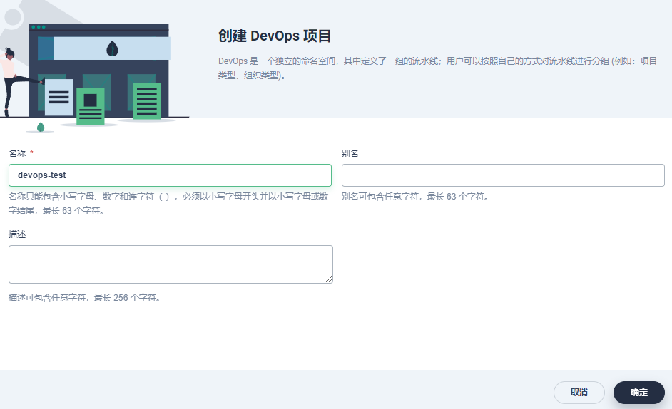

### 二、DevOps凭证

#### 1、gitee仓库认证`gitee-auth`


#### 2、阿里云docker仓库认证`aliyun-docker-registry-auth`

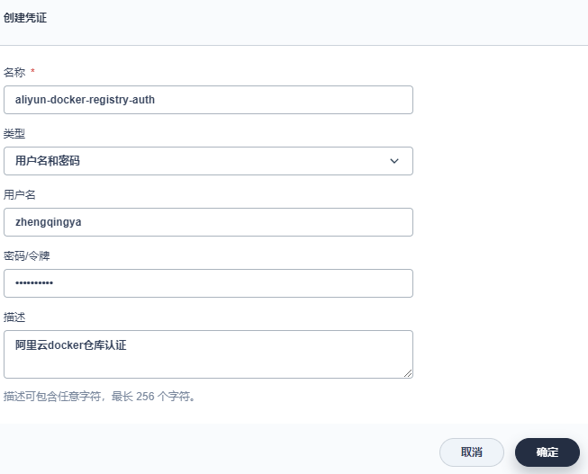

#### 3、k8s凭证`kubeconfig-auth`

```shell
# k8s权限配置文件
cat /root/.kube/config
```

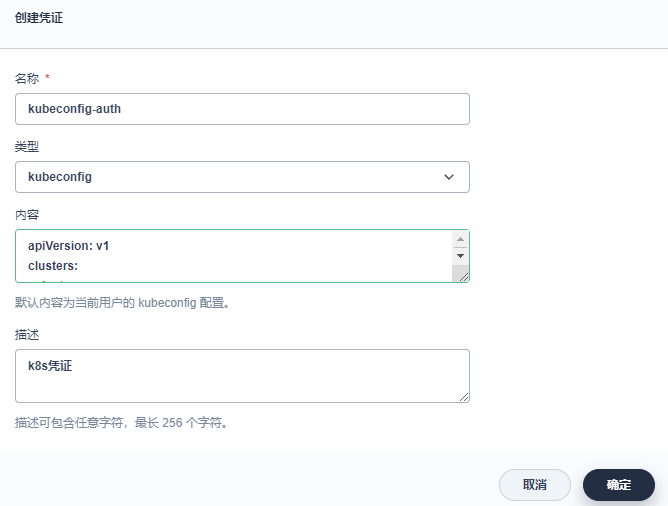

将内容中的`https://lb.kubesphere.local:6443` -> `https://指定IP:6443`，不然之后部署可能会出现问题...


---

最终


### 三、maven配置阿里云中央仓库

`平台管理` -> `集群管理` -> `default` -> `配置` -> `配置字典` -> `ks-devops-agent`


编辑设置

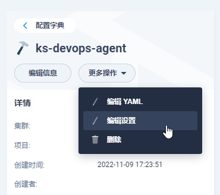

```
<mirrors>
    <!-- 国内中央仓库的配置-阿里云中央仓库 -->
    <mirror>
        <id>nexus-aliyun</id>
        <mirrorOf>central</mirrorOf>
        <name>Nexus aliyun</name>
        <url>http://maven.aliyun.com/nexus/content/groups/public</url>
    </mirror>
</mirrors>
```

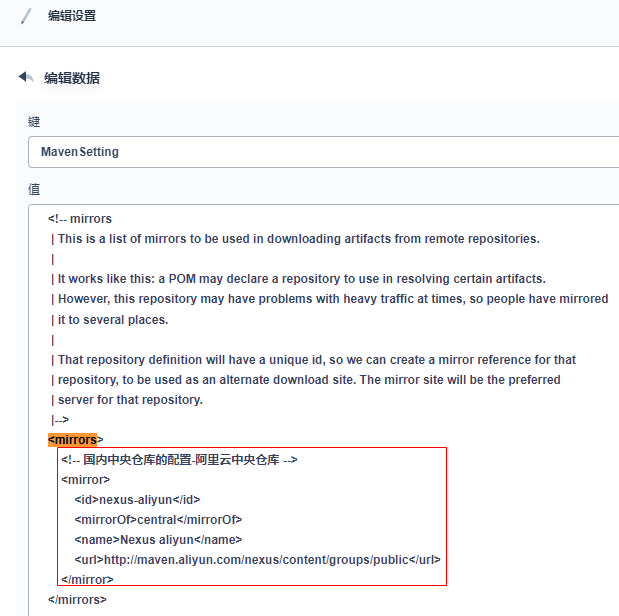

### 四、k8s-项目配置

#### 阿里云docker仓库认证 `aliyun-docker-registry-auth`

`项目` -> `配置` -> `保密字典`

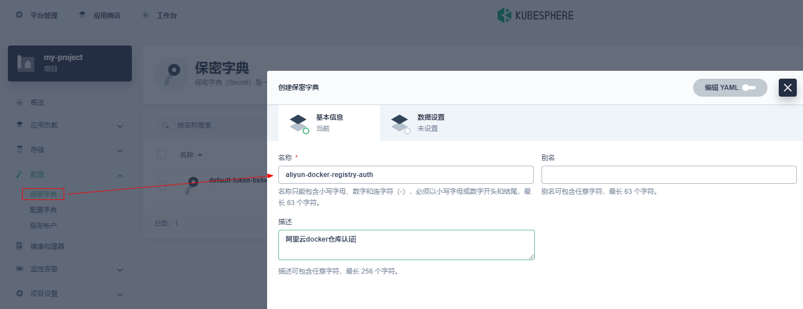

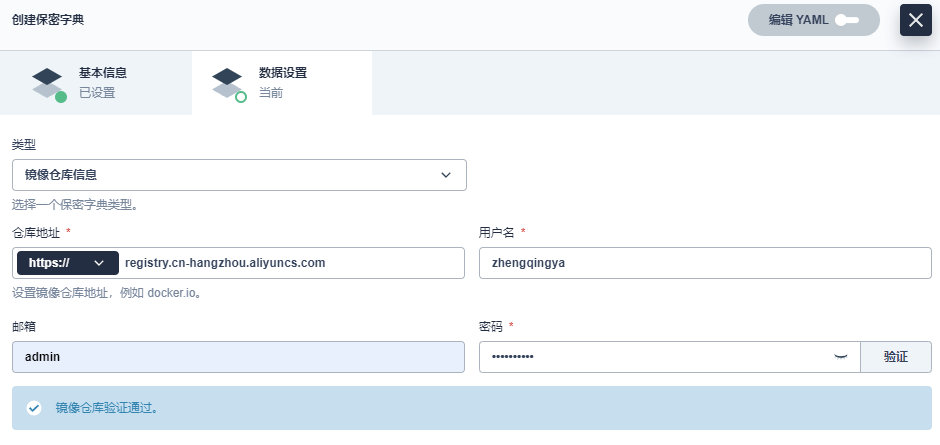


```shell
# 也可通过命令查看凭证
kubectl get secrets -n my-project
```

### 五、创建流水线

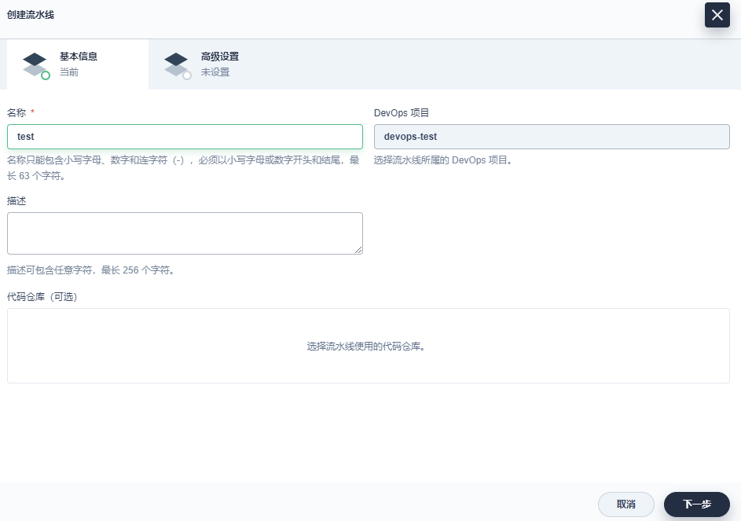

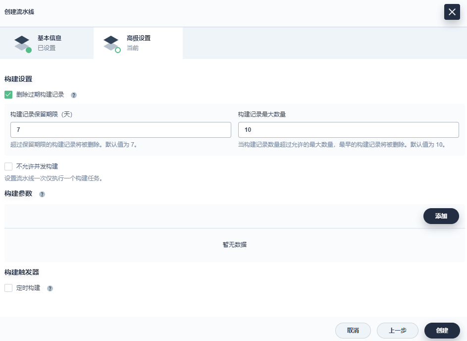

进入后可以点击`编辑流水线`，提供了一些模板

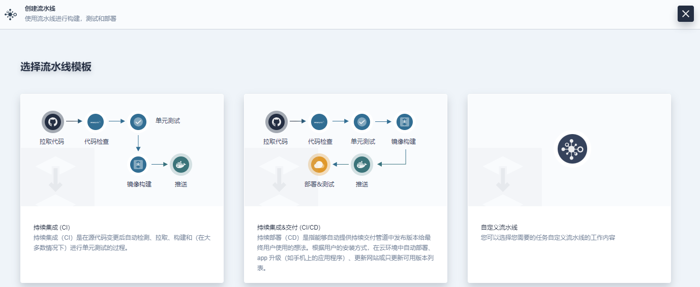

ex: 第一步拉取代码


这里自己点着玩吧，很简单... 根据自己的需求去定制即可...


### 六、其它

#### `Jenkinsfile`

可参考：[Jenkinsfile](Jenkinsfile)

#### `k8s-deploy.yml`

可参考：[k8s-deploy.yml](k8s-deploy.yml)

###### k8s yaml 在线编写工具

- https://k8syaml.com

#### 报错 `ERROR: java.lang.RuntimeException: io.kubernetes.client.openapi.ApiException: java.net.UnknownHostException: lb.kubesphere.local: Name or service not known`

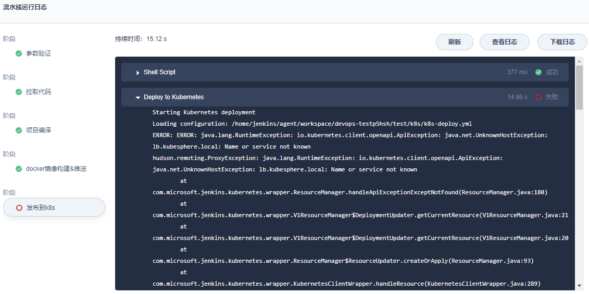

```shell
Deploy to Kubernetes14.66 s失败
Starting Kubernetes deployment
Loading configuration: /home/jenkins/agent/workspace/devops-testp5hsh/test/k8s/k8s-deploy.yml
ERROR: ERROR: java.lang.RuntimeException: io.kubernetes.client.openapi.ApiException: java.net.UnknownHostException: lb.kubesphere.local: Name or service not known
hudson.remoting.ProxyException: java.lang.RuntimeException: io.kubernetes.client.openapi.ApiException: java.net.UnknownHostException: lb.kubesphere.local: Name or service not known
	at com.microsoft.jenkins.kubernetes.wrapper.ResourceManager.handleApiExceptionExceptNotFound(ResourceManager.java:180)
	at com.microsoft.jenkins.kubernetes.wrapper.V1ResourceManager$DeploymentUpdater.getCurrentResource(V1ResourceManager.java:213)
	at com.microsoft.jenkins.kubernetes.wrapper.V1ResourceManager$DeploymentUpdater.getCurrentResource(V1ResourceManager.java:201)
	at com.microsoft.jenkins.kubernetes.wrapper.ResourceManager$ResourceUpdater.createOrApply(ResourceManager.java:93)
	at com.microsoft.jenkins.kubernetes.wrapper.KubernetesClientWrapper.handleResource(KubernetesClientWrapper.java:289)
	at com.microsoft.jenkins.kubernetes.wrapper.KubernetesClientWrapper.apply(KubernetesClientWrapper.java:256)
	at com.microsoft.jenkins.kubernetes.command.DeploymentCommand$DeploymentTask.doCall(DeploymentCommand.java:172)
	at com.microsoft.jenkins.kubernetes.command.DeploymentCommand$DeploymentTask.call(DeploymentCommand.java:124)
	at com.microsoft.jenkins.kubernetes.command.DeploymentCommand$DeploymentTask.call(DeploymentCommand.java:106)
	at hudson.remoting.UserRequest.perform(UserRequest.java:212)
	at hudson.remoting.UserRequest.perform(UserRequest.java:54)
	at hudson.remoting.Request$2.run(Request.java:369)
	at hudson.remoting.InterceptingExecutorService$1.call(InterceptingExecutorService.java:72)
	at java.util.concurrent.FutureTask.run(FutureTask.java:266)
	at java.util.concurrent.ThreadPoolExecutor.runWorker(ThreadPoolExecutor.java:1149)
	at java.util.concurrent.ThreadPoolExecutor$Worker.run(ThreadPoolExecutor.java:624)
	at hudson.remoting.Engine$1.lambda$newThread$0(Engine.java:93)
	at java.lang.Thread.run(Thread.java:748)
	Suppressed: hudson.remoting.Channel$CallSiteStackTrace: Remote call to JNLP4-connect connection from 10.233.70.143/10.233.70.143:51962
		at hudson.remoting.Channel.attachCallSiteStackTrace(Channel.java:1800)
		at hudson.remoting.UserRequest$ExceptionResponse.retrieve(UserRequest.java:357)
		at hudson.remoting.Channel.call(Channel.java:1001)
		at hudson.FilePath.act(FilePath.java:1160)
		at com.microsoft.jenkins.kubernetes.command.DeploymentCommand.execute(DeploymentCommand.java:68)
		at com.microsoft.jenkins.kubernetes.command.DeploymentCommand.execute(DeploymentCommand.java:45)
		at com.microsoft.jenkins.azurecommons.command.CommandService.runCommand(CommandService.java:88)
		at com.microsoft.jenkins.azurecommons.command.CommandService.execute(CommandService.java:96)
		at com.microsoft.jenkins.azurecommons.command.CommandService.executeCommands(CommandService.java:75)
		at com.microsoft.jenkins.azurecommons.command.BaseCommandContext.executeCommands(BaseCommandContext.java:77)
		at com.microsoft.jenkins.kubernetes.KubernetesDeploy.perform(KubernetesDeploy.java:42)
		at com.microsoft.jenkins.azurecommons.command.SimpleBuildStepExecution.run(SimpleBuildStepExecution.java:54)
		at com.microsoft.jenkins.azurecommons.command.SimpleBuildStepExecution.run(SimpleBuildStepExecution.java:35)
		at org.jenkinsci.plugins.workflow.steps.SynchronousNonBlockingStepExecution.lambda$start$0(SynchronousNonBlockingStepExecution.java:47)
		at java.util.concurrent.Executors$RunnableAdapter.call(Executors.java:511)
		at java.util.concurrent.FutureTask.run(FutureTask.java:266)
		at java.util.concurrent.ThreadPoolExecutor.runWorker(ThreadPoolExecutor.java:1149)
		at java.util.concurrent.ThreadPoolExecutor$Worker.run(ThreadPoolExecutor.java:624)
		... 1 more
Caused by: hudson.remoting.ProxyException: io.kubernetes.client.openapi.ApiException: java.net.UnknownHostException: lb.kubesphere.local: Name or service not known
	at io.kubernetes.client.openapi.ApiClient.execute(ApiClient.java:898)
	at io.kubernetes.client.openapi.apis.AppsV1Api.readNamespacedDeploymentWithHttpInfo(AppsV1Api.java:7299)
	at io.kubernetes.client.openapi.apis.AppsV1Api.readNamespacedDeployment(AppsV1Api.java:7275)
	at com.microsoft.jenkins.kubernetes.wrapper.V1ResourceManager$DeploymentUpdater.getCurrentResource(V1ResourceManager.java:210)
	... 16 more
Caused by: hudson.remoting.ProxyException: java.net.UnknownHostException: lb.kubesphere.local: Name or service not known
	at java.net.Inet4AddressImpl.lookupAllHostAddr(Native Method)
	at java.net.InetAddress$2.lookupAllHostAddr(InetAddress.java:929)
	at java.net.InetAddress.getAddressesFromNameService(InetAddress.java:1324)
	at java.net.InetAddress.getAllByName0(InetAddress.java:1277)
	at java.net.InetAddress.getAllByName(InetAddress.java:1193)
	at java.net.InetAddress.getAllByName(InetAddress.java:1127)
	at okhttp3.Dns.lambda$static$0(Dns.java:39)
	at okhttp3.internal.connection.RouteSelector.resetNextInetSocketAddress(RouteSelector.java:171)
	at okhttp3.internal.connection.RouteSelector.nextProxy(RouteSelector.java:135)
	at okhttp3.internal.connection.RouteSelector.next(RouteSelector.java:84)
	at okhttp3.internal.connection.ExchangeFinder.findConnection(ExchangeFinder.java:187)
	at okhttp3.internal.connection.ExchangeFinder.findHealthyConnection(ExchangeFinder.java:108)
	at okhttp3.internal.connection.ExchangeFinder.find(ExchangeFinder.java:88)
	at okhttp3.internal.connection.Transmitter.newExchange(Transmitter.java:169)
	at okhttp3.internal.connection.ConnectInterceptor.intercept(ConnectInterceptor.java:41)
	at okhttp3.internal.http.RealInterceptorChain.proceed(RealInterceptorChain.java:142)
	at okhttp3.internal.http.RealInterceptorChain.proceed(RealInterceptorChain.java:117)
	at okhttp3.internal.cache.CacheInterceptor.intercept(CacheInterceptor.java:94)
	at okhttp3.internal.http.RealInterceptorChain.proceed(RealInterceptorChain.java:142)
	at okhttp3.internal.http.RealInterceptorChain.proceed(RealInterceptorChain.java:117)
	at okhttp3.internal.http.BridgeInterceptor.intercept(BridgeInterceptor.java:93)
	at okhttp3.internal.http.RealInterceptorChain.proceed(RealInterceptorChain.java:142)
	at okhttp3.internal.http.RetryAndFollowUpInterceptor.intercept(RetryAndFollowUpInterceptor.java:88)
	at okhttp3.internal.http.RealInterceptorChain.proceed(RealInterceptorChain.java:142)
	at okhttp3.internal.http.RealInterceptorChain.proceed(RealInterceptorChain.java:117)
	at okhttp3.RealCall.getResponseWithInterceptorChain(RealCall.java:221)
	at okhttp3.RealCall.execute(RealCall.java:81)
	at io.kubernetes.client.openapi.ApiClient.execute(ApiClient.java:894)
	... 19 more
Api call failed with code 0, detailed message: null
Kubernetes deployment ended with HasError
```

##### 解决：

> `kubesphere 3.2.1` 流水线调整

###### 第一步：替换`kubernetesDeploy`部署方式

> https://github.com/kubesphere/website/pull/2098

```
stage('发布到k8s') {
    agent none
    steps {
        container('maven') {
            // 废弃...
            //     kubernetesDeploy(enableConfigSubstitution: true, deleteResource: false, kubeconfigId: 'kubeconfig-auth', configs: 'k8s/**')
            // 改为下面这种方式
            withCredentials([kubeconfigFile(credentialsId: 'kubeconfig-auth', variable: 'KUBECONFIG')]) {
                // envsubst: 将相关参数传给该yml文件
                sh 'envsubst < k8s/k8s-deploy.yml | kubectl apply -f -'
            }
        }
    }
}
```

###### 第二步：修改DevOps凭证`kubeconfig`

将内容中的`https://lb.kubesphere.local:6443` -> `https://指定IP:6443`


最终发布成功

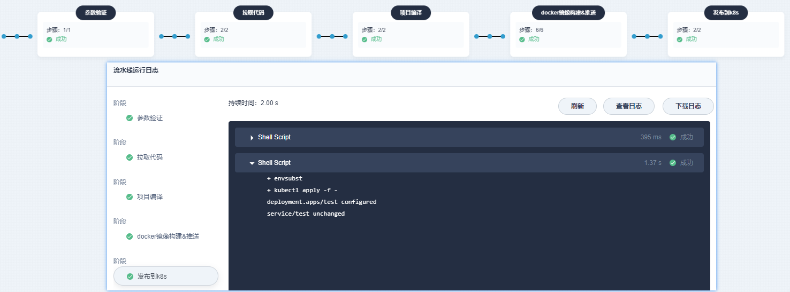
